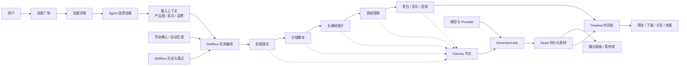
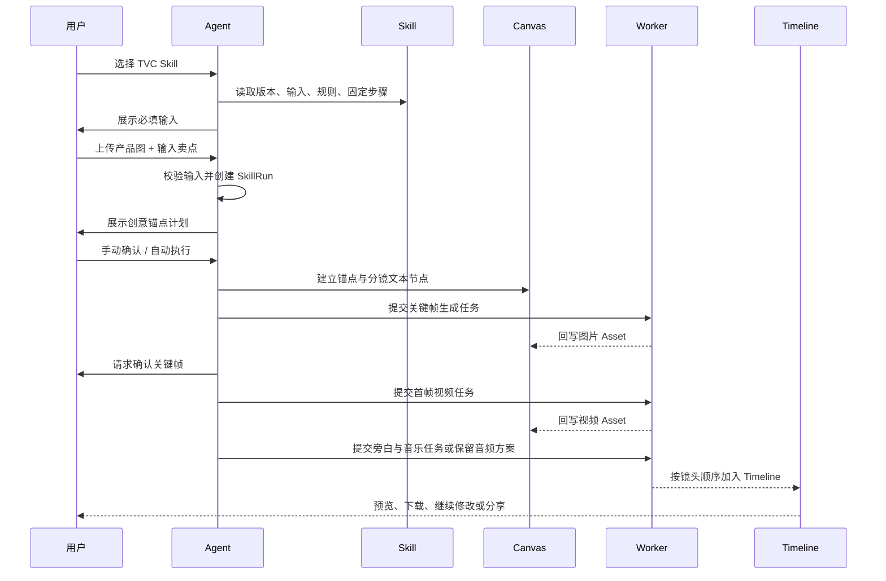

# QUill 产品架构与 TVC Skill 工作流

> 状态：产品方案草案
>
> 范围：基于 TapNow Canvas 的产品审计结果，结合 QUill 当前的 `Project → Workflow → GenerationJob → Asset → TimelineItem → GenerationReference` 契约，规划 Agent、Skill 与画布的协作方式。

## 1. 产品判断

QUill 不应只做成“多个图片/视频生成节点的集合”。它的核心产品应是：

> Agent 负责理解和编排，Skill 负责固定方法，Canvas 负责呈现和编辑，GenerationJob 负责执行，Asset/Timeline 负责沉淀结果。

用户看到的是一支广告片；系统内部必须保留可追踪的创意锚点、分镜、关键帧、视频片段、声音方案和时间线关系。

## 2. 产品架构图



### 2.1 六个产品层

| 层级 | 职责 | QUill 对应 |
|---|---|---|
| 项目层 | 画布、项目切换、保存、分享 | `Project`、工作区顶栏 |
| 画布层 | 节点、连线、引用、时间线 | `Workflow`、Canvas、Timeline |
| Agent 层 | 对话、任务规划、模型选择、确认模式 | Agent 面板与输入框 |
| Skill 层 | 固定方法、输入、规则、提示词、输出 | `standalone/skills/*/skill.json` |
| 执行层 | 异步生成、进度、失败、重试 | `GenerationJob`、Worker、Provider |
| 资产层 | 预览、下载、复用、历史、分享 | `Asset`、素材库、输出面板 |

### 2.2 必须保持的系统边界

- Canvas、Timeline 和 Agent 不直接调用厂商 API，只提交能力和参数。
- 所有上传或生成的媒体都先变成持久化 `assetId`，不能把厂商临时 URL 当作业务数据。
- 生成状态统一为 `queued → processing → succeeded | failed | canceled`。
- Skill 只描述方法和工作流；一次实际执行必须有独立的 `SkillRun`。
- 对话建议默认只读；只有用户选择并确认 Skill 后，才允许写入画布。

## 3. TVC Skill 的标准执行流程



### 3.1 新中式 TVC 的固定步骤

1. 锁定产品、品牌、角色、场景、服化、灯光、色调和镜头语言。
2. 先生成创意锚点，再生成 15 秒五镜头分镜。
3. 按分镜逐镜生成关键帧，产品图作为主体参考。
4. 按关键帧逐镜生成首帧视频，每镜只保留一条主要动作链。
5. 生成旁白、音乐和音效方案；音频模型不可用时，保留可执行的音频制作节点。
6. 将成功的视频片段按镜头顺序加入 Timeline，并保留每个片段的来源引用。

## 4. Skill 数据与运行态

### 4.1 Skill 静态定义

现有 `skill.json` 已经覆盖大部分产品需求：

```json
{
  "id": "new-chinese-tvc",
  "version": 1,
  "kind": "视频",
  "inputs": ["产品图片", "产品卖点", "品牌名称"],
  "fixedSteps": ["创意锚点", "五镜头分镜", "关键帧", "首帧视频", "声音方案"],
  "rules": { "format": "16:9", "durationSec": 15, "shotCount": 5 },
  "execution": {
    "requiresExplicitSelection": true,
    "autoRun": true,
    "generateKeyframes": true,
    "generateShotVideos": true,
    "appendVideosToTimeline": true
  }
}
```

### 4.2 需要补充的 SkillRun 运行态

运行态不应写回 Skill 定义，建议独立保存：

```json
{
  "runId": "run_xxx",
  "projectId": "project_xxx",
  "skillId": "new-chinese-tvc",
  "skillVersion": 1,
  "status": "processing",
  "inputValues": {
    "productImageAssetId": "asset_xxx",
    "sellingPoints": "天然玉石、牡丹雕花",
    "brandName": "示例品牌"
  },
  "steps": [
    { "id": "anchor", "status": "succeeded", "nodeIds": ["node_xxx"] },
    { "id": "storyboard", "status": "processing", "nodeIds": ["node_xxx"] },
    { "id": "keyframes", "status": "queued", "nodeIds": [] }
  ],
  "assetIds": [],
  "error": null
}
```

这样可以支持：进度展示、失败重试、断点继续、取消任务、运行历史、同一 Skill 的不同版本和结果追踪。

## 5. UI 产品结构

### 5.1 技能广场

技能广场只负责发现和管理，不直接执行复杂工作流。

- 卡片：封面、名称、分类、摘要、作者、使用次数。
- 二级详情：完整说明、怎么用、固定步骤、输入、输出、限制、案例。
- 操作：收藏、使用、导入、刷新。
- 点击“使用”：关闭技能广场，将 `skillId + version` 注入 Agent，不直接改画布。

### 5.2 Agent 输入框

- 显示当前已选 Skill chip。
- 显示上传图片缩略图，点击可预览，删除只移除本次输入。
- 显示必填输入缺失提示，不让任务静默失败。
- 支持“手动确认 / 自动执行”。
- 支持从画布选择节点作为参考。
- 支持切换模型，但模型选择不改变 Skill 的固定方法。

### 5.3 画布执行区

- 先创建“计划节点”，再创建媒体生成节点。
- 每个节点带 `skillRunId`、`stepId`、`shotId`，方便追踪来源。
- 每个生成节点显示排队、处理中、完成、失败、重试和取消。
- Skill 执行完成后，保留完整节点图，不只显示最终视频。

### 5.4 输出与时间线

- 输出面板展示本次 SkillRun 的图片、视频、音频和文本结果。
- 支持预览、下载、重新引用、加入时间线。
- 时间线片段必须保留 `assetId` 和来源镜头编号。
- 下载视频/图片前，页面内先展示真实预览，不只显示文件名或文字状态。

## 6. 功能优先级

### P0：必须先完成

| 优先级 | 功能 | 验收标准 |
|---|---|---|
| P0 | Skill 选择到 Agent 的桥接 | 点击卡片“使用”后，Agent 显示 Skill chip，并携带正确的 `skillId/version` |
| P0 | 多媒体 Skill 导入 | 图片、视频、音频、混合类型都能通过 schema 校验并进入技能库 |
| P0 | 输入校验 | 产品图、卖点等必填项缺失时，明确指出缺失字段，不提交生成任务 |
| P0 | SkillRun 运行态 | 每次执行都有 runId、步骤状态、节点 ID、资产 ID和错误信息 |
| P0 | 固定步骤编排 | TVC Skill 能按锚点→分镜→关键帧→视频→声音→时间线执行，顺序不可被普通提示词破坏 |
| P0 | 手动确认边界 | 手动模式在关键帧和大批量视频生成前暂停，自动模式才连续执行 |
| P0 | 输出预览与下载 | 生成成功后，图片/视频能在页面展示、预览和下载，并能加入时间线 |
| P0 | 任务恢复 | 单个镜头失败可重试，不需要从头执行整套 TVC |

### P1：形成可用产品

| 优先级 | 功能 | 价值 |
|---|---|---|
| P1 | Skill 二级详情页 | 让用户在使用前理解输入、步骤、限制和输出 |
| P1 | SkillRun 历史 | 查看某次执行的输入、步骤、产物和失败原因 |
| P1 | 快速 TVC 预设 | 一键创建 15 秒、30 秒、竖版、电商广告等标准工作流 |
| P1 | 关键帧审核 | 关键帧不通过时只重做指定镜头 |
| P1 | 资产引用 | 素材库、画布节点、时间线片段都能作为 Skill 输入 |
| P1 | 音频适配器 | 旁白、音乐、音效从方案节点进入实际音频生成和混音 |
| P1 | 统一结果面板 | 合并本次任务的文本、图片、视频和音频结果，避免历史分散 |

### P2：规模化与生态

| 优先级 | 功能 | 价值 |
|---|---|---|
| P2 | Skill 版本管理 | 支持版本发布、回滚、兼容性提示和运行记录绑定版本 |
| P2 | 团队 Skill | 私有技能、权限、共享、审核和团队模板 |
| P2 | 外部应用连接 | 接入云盘、素材库、协作工具和发布渠道 |
| P2 | 分享与克隆 | 分享完整画布、SkillRun 或只分享最终成片 |
| P2 | 运行数据分析 | 统计成功率、平均耗时、成本、常见失败步骤和下载率 |

## 7. 第一阶段建议的最小闭环

第一阶段不要同时做完整市场、团队权限和外部应用。建议只打通下面这条闭环：

```text
技能卡片
→ 二级详情
→ Agent 选择 Skill
→ 上传产品图 / 输入卖点
→ 创建 SkillRun
→ 生成锚点与五镜头分镜
→ 逐镜生成关键帧
→ 用户确认
→ 生成视频片段
→ 页面预览与下载
→ 自动加入 Timeline
```

第一阶段完成标准：用户可以从一个 TVC Skill 开始，在不手动拼接节点的情况下得到一条可预览、可下载、可继续修改的时间线草稿；任何一步失败，都能明确知道失败在哪个镜头、哪个任务和哪个模型。

## 8. 当前项目的落地映射

| 产品能力 | 当前项目基础 | 下一步 |
|---|---|---|
| 画布节点与连线 | `standalone/public/app.js` 已有 Workflow、节点、边和能力推断 | 给 Skill 生成节点补充 `skillRunId/stepId` |
| 生成任务 | 已有 `queued/processing/succeeded/failed/canceled` 领域约定 | 将单次 SkillRun 与多个 GenerationJob 关联 |
| 素材持久化 | 已有 `Asset` 和素材库边界 | 输出面板按 SkillRun 聚合结果 |
| 时间线 | 已有独立 Timeline 与 GenerationReference | 按镜头顺序自动加入并保留来源 |
| 技能库 | 已有 `skill.json`、详情页和导入技能入口 | 打通“使用”到 Agent，而不是在技能广场执行 |
| Agent | 已有模型选择、上传、技能按钮和对话 | 增加 Skill chip、必填输入和运行进度 |
| TVC Skill | 已有 `new-chinese-tvc` 固定步骤与模板 | 先实现 P0 的 SkillRun 编排和断点重试 |

## 9. 产品指标

- Skill 使用率：查看详情后点击“使用”的比例。
- 首个有效节点耗时：从发送输入到第一个成功节点的时间。
- TVC 完成率：成功生成至少一条视频片段并加入时间线的比例。
- 分镜返工率：关键帧或视频镜头被重试的比例。
- 任务失败定位率：失败任务是否能定位到 Skill、步骤、镜头和 Provider。
- 结果下载率与二次引用率：输出是否真正进入后续创作。
- Skill 导入成功率：图片、视频、音频和混合技能分别统计。

## 10. 结论

QUill 下一阶段最重要的不是再增加更多生成按钮，而是建立一个稳定的“Skill → SkillRun → Canvas Nodes → Assets → Timeline”执行链。

只要这条链稳定，后续新增 TVC、UGC、产品海报、角色设计、分镜拆解等 Skill，主要变成新增配置和提示词，不需要重复开发一套界面。
